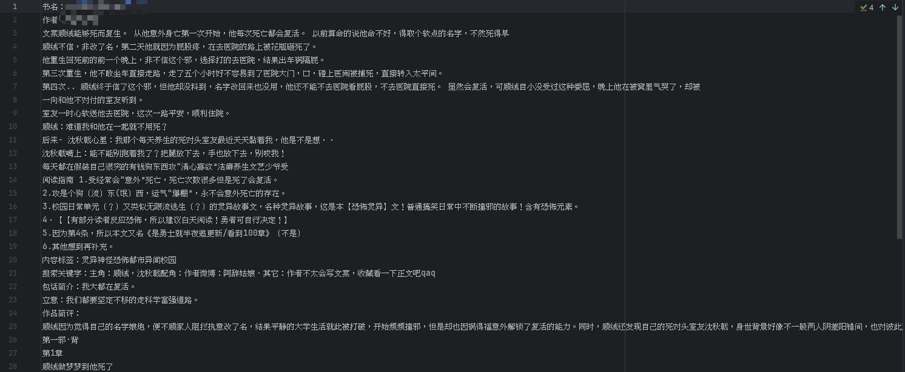

# Diyibanzhu-Download

## 第一版主网小说下载器

---

### 快速使用

#### 脚本

1. 浏览器安装 [Tampermonkey](https://github.com/Tampermonkey/tampermonkey) 拓展插件
2. 安装脚本

#### 后处理程序

1. 下载 [Release](https://github.com/LanluZ/Diyibanzhu-Download/releases) 中的源码
2. 下载 [PaddleOCR-json](https://github.com/hiroi-sora/PaddleOCR-json/releases) 程序
3. 下载 [poppler](https://poppler.freedesktop.org) 程序
4. 解压 poppler 与 PaddleOCR-json 到本项目`ocr`文件夹下
   ```
      ├── ocr
      │   ├── api
      │   ├── data
      │   ├── main.py
      │   ├── PaddleOCR-json < PaddleOCR-json 程序目录
      │   ├── pdf.py
      │   ├── poppler < poppler 程序目录
      └── README.md
   ```
5. 安装程序依赖`pip install -r ./requirements.txt`
6. 将脚本下载得到的pdf文件放入`ocr/data/pdf`文件夹后运行`main.py`程序
7. 输出文本在`ocr/data/txt`文件夹中

### 兼容性

#### [PaddleOCR-json](https://github.com/hiroi-sora/PaddleOCR-json)

- 系统支持 Win7 x64 及以上。Linux的支持正在筹备。
- 若 Win7 报错`计算机中丢失 VCOMP140.DLL` ，请安装 [VC运行库](https://aka.ms/vs/17/release/vc_redist.x64.exe) 。
- CPU必须具有AVX指令集。常见的家用CPU一般都满足该条件。

| AVX   | 支持的产品系列                            | 不支持                                  |
|-------|------------------------------------|--------------------------------------|
| Intel | 酷睿Core，至强Xeon                      | 凌动Atom，安腾Itanium，赛扬Celeron，奔腾Pentium |
| AMD   | 推土机架构及之后的产品，如锐龙Ryzen、速龙Athlon、FX 等 | K10架构及之前的产品      |


### 感谢

1. [Tampermonkey](https://github.com/Tampermonkey/tampermonkey): 用户脚本管理器
2. [PaddleOCR-json](https://github.com/hiroi-sora/PaddleOCR-json): OCR离线图片文字识别命令行windows程序
3. [pdf2image](https://github.com/Belval/pdf2image/tree/master): 将pdf转化为PIL图像的模块

---

该脚本仅供学习使用


### 预览

#### 网站页面


#### pdf下载结果


#### ocr识别结果



